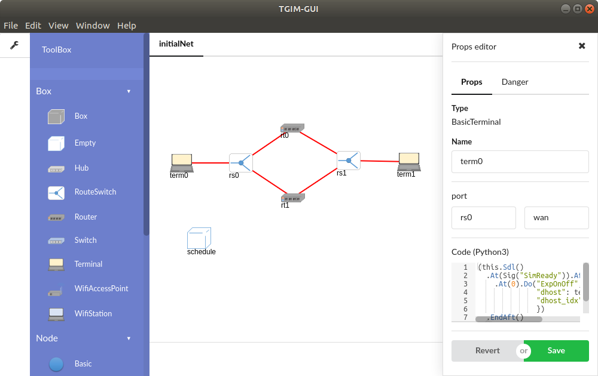

# TGIM-GUI

  

TGIM-GUI is graphical tool of generating that ns-3 network simulation.

Graphical Node and Channel is available by this tool.

Box is also available, the box is concept of Network-Equipment(Box).

Box is aggregation of Node and Channel, but that is easily to use than Node/Channel.

Box is finnaly converted to Node and Channel, and executed as a simulation by ns-3.

## Example

This example is two-route switching scinario.

It could be schedule by Python coding.